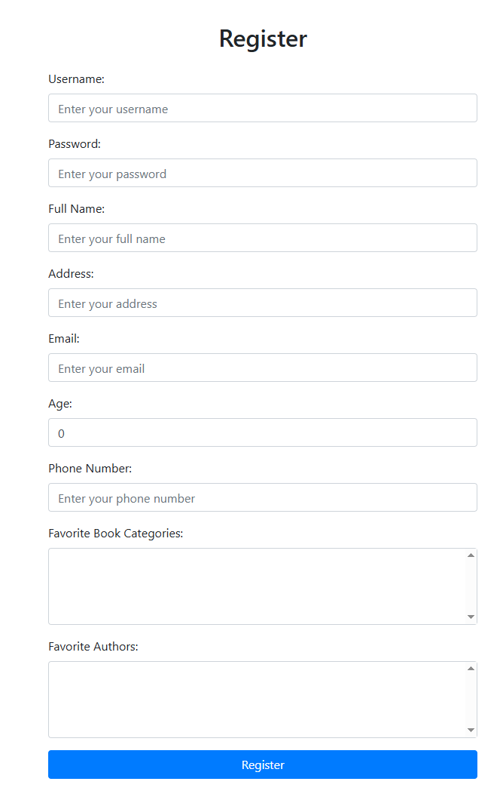

# Online Bookstore Web Application

A full-stack web application developed as part of a university software development project.  
The application allows users to create accounts, manage profiles, offer books, search for available books,
and interact with other users.

## Features

- User registration and login
- User authentication and authorization with Spring Security
- Profile management
- Book offer management
- Book search functionality
- HTML-based user interface
- MySQL database integration

## Application Preview

## Technologies Used

- Java
- Spring Boot
- Spring Security
- MySQL
- HTML
- Git / GitHub

## Architecture

The application follows an MVC-based structure, separating controllers, views, models, services,
and data access logic to improve maintainability and code organization.

## Project Context

This project was developed for a university course focused on the design and implementation of web
applications, applying software engineering principles and development best practices.
